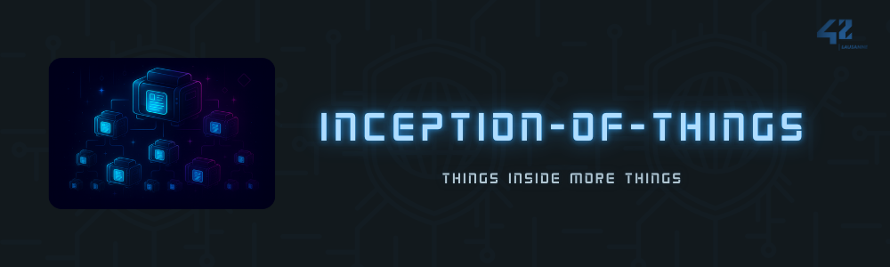

 

## Index

- [Consigne](#consigne)
- [Partie 1 - Vagrant & K3s](#p1-vagrant--k3s)
- [Partie 2 - K3s & replicas d'applications](#p2-k3s--replicas-dapplications)
- [Partie 3 - K3d & ArgoCD](#p3-k3d--argocd)

 

## Consigne

Ce projet **Inception of Things** (IoT) consiste à déployer une stack Kubernetes de plusieurs façons.  
Il est divisé en **3 parties indépendantes** :  

1. **Partie 1 : Vagrant & K3s**  
   - Créer deux VMs avec Vagrant (un contrôleur, un worker).  
   - Installer et configurer K3s dessus.  

2. **Partie 2 : K3s & réplicas d'applications**  
	- Déployer un cluster K3s sur une seule VM via Vagrant.  
	- Déployer 3 applications web (basées sur nginx:alpine) derrière un Ingress Controller (Traefik) avec du host-based routing :  
	  - `app1.com` → Application 1 (1 replica)  
	  - `app2.com` → Application 2 (3 replicas)  
	  - Route par défaut → Application 3 (1 replica)  
	- Configurer les services, l’Ingress et la redirection de ports pour accéder aux applications via leur nom de domaine.

3. **Partie 3 : K3d & ArgoCD**  
   - Déployer un cluster Kubernetes avec K3d (Docker).  
   - Installer ArgoCD et mettre en place du GitOps (déploiement auto d’une appli depuis un repo GitHub public).  

 

## [P1] Vagrant & K3s

[Voir exigences et implementation](./p1/README.md)

**VMs VirtualBox** créées via Vagrant.  
1 contrôleur (`cedmulleS`) et 1 worker (`cedmulleSW`).  
Réseau privé (192.168.56.x).  
K3s installé automatiquement par provisioning.  
Connexion SSH configurée via clés publiques.  

### Fonctionnalités principales
- `Vagrantfile` crée 2 VMs Ubuntu 22.04 :  
  - **cedmulleS** (controller, IP : `192.168.56.110`)  
  - **cedmulleSW** (worker, IP : `192.168.56.111`)  
- Authentification par clés SSH.  
- Installation automatique de `curl`, `nc`, `net-tools` et `k3s` (controller + agent).  
- Le worker attend que le controller soit prêt (`nc -z IP 6443`).  

### Commandes Makefile
- `make up` : démarre les 2 VMs.  
- `make halt` : arrête les VMs.  
- `make destroy` : détruit les VMs.  
- `make status` : statut des VMs.  
- `make ssh-controller` / `make ssh-worker` : accès SSH direct.  
- `make check-ip` : affiche les IP respectives des VMs.  
- `make k3s-status` : vérifie que K3s est actif sur les deux VMs.
- `make kubectl-nodes` : affiche les nœuds Kubernetes.

### Vérifications
- Controller K3s actif : `systemctl status k3s-server`.  
- Worker relié au cluster : `systemctl status k3s-agent`.  
- Depuis controller : `kubectl get nodes` → 2 nœuds (Ready).  

 

## [P2] K3s & Réplicas d’Applications

[Voir exigences et implementation](./p2/README.md)

Cluster **K3s** déployé sur une seule VM via Vagrant.  
3 applications web simples déployées derrière un Ingress Controller (**Traefik**) avec du **host-based routing** :  
- `app1.com` → Application 1  
- `app2.com` → Application 2 (**3 replicas**)  
- Route par défaut → Application 3  

### Fonctionnalités principales
- VM unique créée via **Vagrant** (nom : `cduffautS`, IP : `192.168.56.110`, Ubuntu 22.04, 2 CPU, 2048 MB RAM).
- **K3s** installé en mode server.
- **3 applications** déployées (basées sur `nginx:alpine`) :
	- **App1** : 1 replica, Service `ClusterIP`, contenu `"Hello from App1!"`, routée par `app1.com`.
	- **App2** : 3 replicas, Service `ClusterIP`, contenu `"Hello from App2!"`, routée par `app2.com`.
	- **App3** : 1 replica, Service `ClusterIP`, contenu `"Hello from App3! - DEFAULT application"`, routée par défaut.
- **Ingress Traefik** configuré pour router selon le nom de domaine (host-based).
- Redirection de port : `8080 (host)` → `80 (guest)`.
- Ajout de règles dans `/etc/hosts` pour accéder aux apps via nom de domaine.

### Commandes Makefile

> A venir

### Vérifications
- 1 node K3s actif : `kubectl get nodes` → 1 node Ready.
- 5 pods déployés : `kubectl get pods` (App1 + App2 x3 + App3).
- 3 services `ClusterIP` : `kubectl get services`.
- Ingress configuré : `kubectl get ingress` (routes pour app1.com, app2.com, défaut).
- Accès applicatif :
	- [http://app1.com:8080](http://app1.com:8080) → `"Hello from App1!"`
	- [http://app2.com:8080](http://app2.com:8080) → `"Hello from App2!"` (load balancing entre 3 pods)
	- [http://192.168.56.110:8080](http://192.168.56.110:8080) → `"Hello from App3! - DEFAULT application"`

 

## [P3] K3d & ArgoCD

[Voir exigences et implementation](./p3/README.md)

Cluster Kubernetes lancé avec **k3d** (Docker-in-Docker).  
Namespaces `argocd` et `dev`.  
ArgoCD déployé depuis manifeste officiel.  
Application GitOps (`wil42/playground`) déployée depuis repo public **cedmulle-42iot**.  
Deux versions disponibles : v1 et v2, switch via commit Git → ArgoCD sync.  
UI ArgoCD accessible en local sur `https://localhost:8080`.  

### Fonctionnalités principales
- Cluster Kubernetes lancé avec **k3d**.  
- ArgoCD déployé dans namespace `argocd`.  
- Namespace `dev` pour l’application.  
- Application ArgoCD `iot-playground` créée depuis repo public `https://github.com/aceyzz/cedmulle-42iot.git`.  
- Application expose un **Service ClusterIP** sur le port `8888`.  
- Deux versions disponibles (v1 et v2) :  
  - Version initiale = `{"message":"v1"}`  
  - Switch vers v2 via `make set-version-2`.  

### Commandes Makefile
- `make up` : installe les prérequis (docker, k3d, kubectl…), crée le cluster, déploie ArgoCD et l’application.  
- `make status` : affiche état du cluster, pods, namespaces, application ArgoCD, test HTTP sur app.  
- `make portfw` : ouvre un port-forward local → accès UI ArgoCD sur `https://localhost:8080`.  
- `make set-version-2` : bascule l’application en version 2 via GitOps.  
- `make clean` : supprime uniquement l’application dans `dev`.  
- `make nuke` : détruit complètement le cluster k3d.  

### Vérifications
- ArgoCD Synced/Healthy : `make status` → bloc Application Argo = `SYNCED, HEALTHY`.  
- Application dispo : `curl http://localhost:8888` → `{"message":"v1"}` puis `{"message":"v2"}`.  
- UI ArgoCD accessible : `make portfw` + login `admin`.  

 
